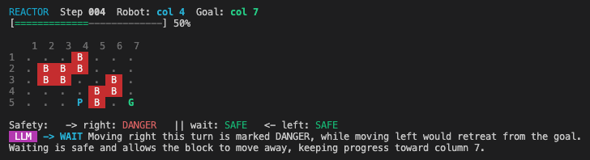

# Robot Navigation Agent `reactor`

## 1. Overview & Goal

### Task Summary

Navigate a robot from column 1 to column 7 on a 7x5 grid, avoiding reactor blocks that oscillate up and down. The robot moves along row 5 (the bottom). Reactor blocks occupy 2 cells each and cycle vertically. An LLM decides each move based on the current board state and programmatic safety analysis.

### Hardcoded Inputs / Initial Data

| Field      | Source                             |
| ---------- | ---------------------------------- |
| API Key    | `AI_DEVS_API_KEY` env              |
| Verify URL | `AI_DEVS_HUB_ENDPOINT` + `/verify` |
| Task Name  | `reactor`                          |
| Grid Size  | 7 columns x 5 rows                 |
| Start      | Column 1, Row 5                    |
| Goal       | Column 7, Row 5                    |
| Commands   | `start`, `right`, `wait`, `left`   |

### API Response Shape

Each command returns:

```json
{
	"code": 100,
	"message": "Player moved right.",
	"board": [
		[".", "B", ".", ".", ".", ".", "."],
		[".", "B", ".", ".", "B", ".", "."],
		[".", ".", "B", "B", "B", "B", "."],
		[".", ".", "B", "B", ".", "B", "."],
		["P", ".", ".", ".", ".", ".", "G"]
	],
	"player": { "col": 1, "row": 5 },
	"goal": { "col": 7, "row": 5 },
	"blocks": [{ "col": 2, "top_row": 1, "bottom_row": 2, "direction": "down" }],
	"reached_goal": false
}
```

- `board` — 2D array indexed `[row][col]`, 0-based arrays but 1-based display
- `blocks` — each block spans 2 rows (`top_row`/`bottom_row`), direction is `"up"` or `"down"`
- `player.col` / `player.row` — 1-indexed
- `reached_goal` — `true` when robot arrives at column 7

### Game Mechanics

- Blocks move **one step** per command issued (including `wait`)
- Blocks reverse direction at grid edges (row 1 top, row 5 bottom)
- Robot is crushed if it occupies the same cell as a block **after** a command
- Column 1 and column 7 have no blocks (safe zones)

### Final Deliverable

The verify response containing `{FLG:...}` after `reached_goal: true`. Capture flag via regex, log it, `process.exit(0)`.

---

## 2. Agent Persona & Prompt Strategy

### System Prompt (for the LLM move-decision agent)

```markdown
You are a robot navigation controller inside a nuclear reactor. Your job is to move the robot safely from column 1 to column 7 along the bottom row of a 7x5 grid.

## Rules

- You can issue exactly ONE command per turn: `right`, `wait`, or `left`
- Reactor blocks (B) occupy 2 cells each and move up/down one step per turn
- If a block reaches row 5 in your column, you are crushed
- Your goal is to reach column 7 as quickly as possible without being crushed

## Decision Process

You receive:

1. The current board state (ASCII grid)
2. Block positions and their movement directions
3. A programmatic safety analysis for each possible action

Based on this information, choose the safest action that makes progress toward column 7.

Prefer `right` when safe. Use `wait` to let a block pass. Use `left` only to escape danger in your current column.

You MUST call the `choose_move` tool with your decision.

### LLM Tool (Function Calling)

The LLM uses OpenAI function calling via the `choose_move` tool instead of returning raw JSON. The tool is defined using `zodFunction` from `openai/helpers/zod` with the `LlmDecisionSchema` Zod schema as parameters. The `client.chat.completions.parse()` method automatically parses tool call arguments and provides typed `parsed_arguments` on the response.
```

---

## 3. Tool Definitions (Function Calls)

### 3.1 `send_command`

**Description:** Send a movement command to the reactor API and return the updated board state.

**Input Schema:**

```json
{
	"type": "object",
	"properties": {
		"command": {
			"type": "string",
			"enum": ["start", "right", "wait", "left"],
			"description": "The command to send to the robot"
		}
	},
	"required": ["command"]
}
```

**Behavior:**

- POST to `{AI_DEVS_HUB_ENDPOINT}/verify` with `{ apikey, task: "reactor", answer: { command } }`
- Use `validateStatus: () => true` to capture all responses
- Parse response and return the board state
- Check `reached_goal` — if true, check response for `{FLG:...}` flag

**Return value:**

```json
{
  "board": "...ascii representation...",
  "player_col": 3,
  "blocks": [...],
  "safety": { "right": "SAFE|DANGER", "wait": "SAFE|DANGER", "left": "SAFE|DANGER" },
  "reached_goal": false,
  "message": "Player moved right."
}
```

---

## 4. Safety Analysis (Programmatic)

Before each LLM call, compute safety for all three actions by simulating block movement one step ahead.

### Algorithm

For each candidate action (`right`, `wait`, `left`):

1. Determine the robot's next column (current +1, same, current -1)
2. Simulate all blocks moving one step in their current direction (reversing at boundaries)
3. Check if any block occupies `(next_col, row 5)` after the move — i.e. `top_row == 5` or `bottom_row == 5`
4. Mark as `DANGER` if a block will be at the robot's destination, `SAFE` otherwise

### Boundary Rules for Block Simulation

- If `direction == "down"` and `bottom_row == 5`: next step reverses to `"up"`, block moves up
- If `direction == "up"` and `top_row == 1`: next step reverses to `"down"`, block moves down
- Otherwise: move one row in the current direction

---

## 5. TUI Display

After each step, render a visual display to the terminal using ANSI colors.

### Layout



### Color Scheme (ANSI escape codes)

| Element      | Color          | Code          |
| ------------ | -------------- | ------------- |
| Header text  | Cyan           | `\x1b[36m`    |
| Progress bar | Green filled   | `\x1b[32m`    |
| B (blocks)   | Red bg + white | `\x1b[41;37m` |
| P (robot)    | Cyan bold      | `\x1b[1;36m`  |
| G (goal)     | Green bold     | `\x1b[1;32m`  |
| . (empty)    | Dim gray       | `\x1b[2m`     |
| SAFE         | Green          | `\x1b[32m`    |
| DANGER       | Red            | `\x1b[31m`    |
| LLM label    | Magenta bg     | `\x1b[45;37m` |
| Command      | Cyan bold      | `\x1b[1;36m`  |

### Progress Bar

```
percentage = ((player.col - 1) / (goal.col - 1)) * 100
filled = Math.round(percentage / 100 * BAR_WIDTH)
```

### Components

1. **Header line** — step number (zero-padded to 3), robot column, goal column
2. **Progress bar** — visual percentage of journey completed
3. **Grid** — 7x5 with column headers, row numbers, colored cells
4. **Safety line** — programmatic safety for right/wait/left with color-coded labels
5. **LLM line** — colored LLM label, chosen command, and reasoning text

The TUI display coexists with structured logs (`logger.agent`, `logger.tool`, `logger.api`).

---

## 6. Execution Flow

```text
START
  │
  ├─ 1. Load config from .env (task = "reactor")
  │
  ├─ 2. Send "start" command → receive initial board
  │
  ├─ 3. Render TUI with initial state
  │
  ├─ 4. GAME LOOP (max AGENT_MAX_TURNS iterations)
  │     │
  │     ├─ a. Compute safety analysis for right/wait/left
  │     │
  │     ├─ b. Build LLM prompt with board ASCII + block info + safety
  │     │
  │     ├─ c. LLM returns { command, reasoning }
  │     │
  │     ├─ d. Send command to API
  │     │
  │     ├─ e. Render TUI with new state
  │     │
  │     ├─ f. If reached_goal → check for flag → exit(0)
  │     │
  │     └─ g. If crushed (error response) → log error → exit(1)
  │
  └─ 5. Max turns exceeded → exit(1)
```

### Key Decision Points

- **LLM tool calling**: The LLM calls the `choose_move` tool (defined via `zodFunction` with `LlmDecisionSchema`). `client.chat.completions.parse()` auto-parses tool arguments. Validated with Zod. On missing/invalid tool call, default to `wait`.
- **Flag capture**: Regex `/\{FLG:.*?\}/` on the full response message. Log via `logger.agent` and `process.exit(0)`.
- **Crush detection**: If the API returns an error or the board shows the robot overlapping a block, reset with `start` and retry.
- **No agent loop needed**: This is NOT an OpenAI function-calling agent loop. It's a simple game loop where the LLM is called directly each step via `chat.completions.create` with structured output.

---

## 7. Dependencies & Environment

### Packages

| Package  | Purpose                         |
| -------- | ------------------------------- |
| `openai` | LLM calls for move decisions    |
| `axios`  | HTTP client for reactor API     |
| `dotenv` | Environment variable management |
| `zod`    | Validate LLM response schema    |

### Environment Variables (`.env`)

```env
OPENAI_API_KEY=<key>
OPENAI_MODEL=gpt-5-mini
AI_DEVS_API_KEY=<key>
AI_DEVS_TASK_NAME=reactor
AI_DEVS_HUB_ENDPOINT=hub_url
AGENT_MAX_TURNS=50
```

### Project Structure

```text
src/
  index.ts          # Entry point — game loop orchestration
  config.ts         # Environment variable loading (exists)
  logger.ts         # Structured logging (exists)
  tui.ts            # TUI display — grid rendering, progress bar, colors
  safety.ts         # Programmatic safety analysis (simulate block movement)
  types.ts          # Zod schemas and TypeScript types for API response
  api.ts            # Reactor API client (send_command)
  llm.ts            # LLM move-decision caller
```

---

## 8. Key Implementation Notes

1. **No OpenAI agent loop** — This is a direct game loop. Each iteration: compute safety → call LLM → send command → render. No function calling / tool use needed.
2. **Safety-first**: The programmatic safety analysis is the primary guard. The LLM receives it as context and should respect it, but the code should also reject obviously dangerous LLM decisions (override `right` to `wait` if right is DANGER).
3. **Block simulation**: Blocks move one step per turn. To predict next state, simulate each block: if at boundary, reverse direction then move; otherwise move in current direction. Check if `bottom_row == 5` for the robot's target column.
4. **1-indexed positions**: The API uses 1-indexed columns and rows. The board array is 0-indexed. Convert carefully: `board[row-1][col-1]`.
5. **Reset on crush**: If the robot gets crushed, send `start` to reset and begin again. Track total attempts.
6. **validateStatus**: Always use `validateStatus: () => true` on axios calls to capture error responses.
7. **Flag regex**: `/\{FLG:.*?\}/` — check every API response message.
8. **LLM temperature**: Use low temperature (0.1-0.3) for deterministic decisions.

---

## 9. Acceptance Criteria

- [ ] `start` command initializes the board and renders first TUI frame
- [ ] Safety analysis correctly predicts block positions one step ahead
- [ ] LLM receives board state + safety analysis and returns valid command
- [ ] Dangerous LLM decisions are overridden (safety guardrail)
- [ ] TUI renders after each step with colored grid, progress bar, safety, and LLM reasoning
- [ ] Structured logs (`logger.agent/tool/api`) print alongside TUI
- [ ] Robot reaches column 7 without being crushed
- [ ] `{FLG:...}` flag captured from API response and logged
- [ ] `process.exit(0)` on flag capture, `process.exit(1)` on failure
- [ ] `AGENT_MAX_TURNS` limits maximum steps
- [ ] No hardcoded API keys or URLs — all from environment variables
- [ ] Crush recovery: automatic reset with `start` on failure
